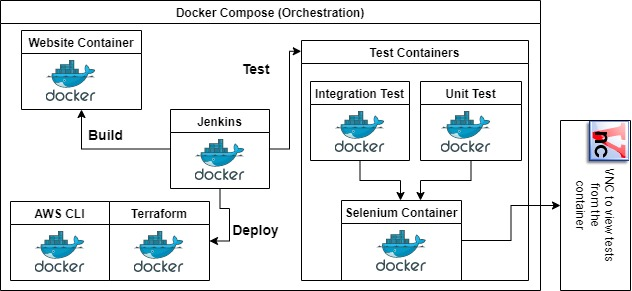

<h1 align="center">DevOps Website Transition</h1>

A hands-on experience with transitioning a traditional website to a more DevOps-friendly environment using Containerization, Infrastructure as Code, and Automated deployment pipeline.

# Application Architecture

# Explaination:

  Container orchestration is done by Docker-Compose
  
  1. **Website**: Website is hosted from a container. Dockerfile is named "Dockerfile" in the root directory. Nginx image is used to host the site on port 80.
  2. **Jenkins**: Jenkins server is also running from a container. It is a good practice because docker provide a separate environment for all your configuration files.
  3. **Test Containers**: There are unit and integration tests added to the application. Both type of tests are run from different containers. A separate container is used to run selenium for remote browser testing. A VNC connection can be esstablished to the selenium container to view the running tests.
  4. **Terraform**: Terraform is also run in a separate container. It contains configuration for the AWS services.
  
 # Other Notes:
 
        ●	Tests are written in with Rspec, Capybara and Selenium.
        ●	Nginx configuration is contained in "nginx.conf" file.
        ●	You need to use AWS Access_key_id and Secret_key in place of environment variables in "docker-compose.yml" for Terraform and AWS CLI container
   

###################🅣🅗🅐🅝🅚🅢##################

